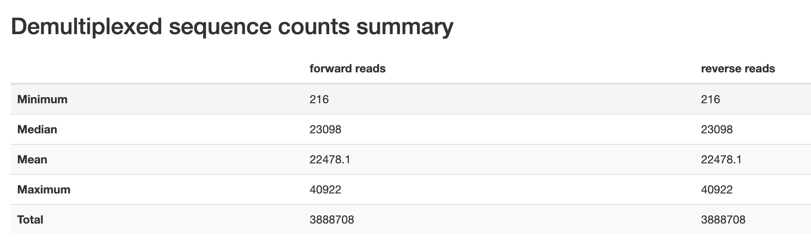
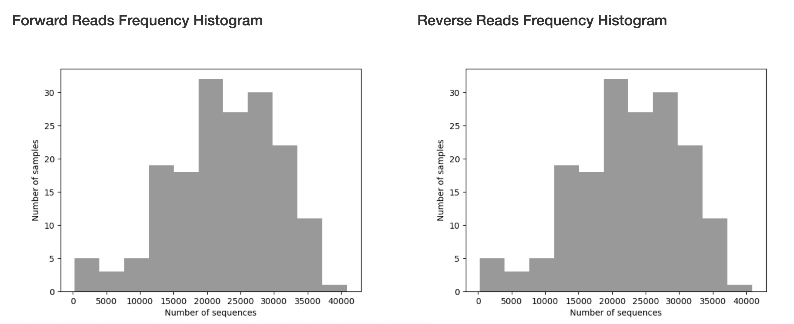
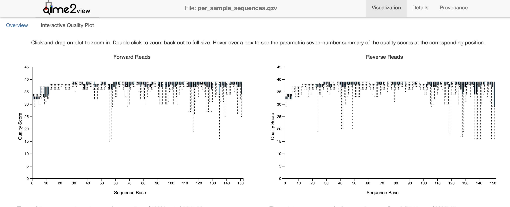

This tutorial will take you through the basics of using QIIME2 with data from UC San Diego. 

# Import and Demultiplex Data

We are going to create an sbatch file with commands for importing and demultiplexing data using QIIME2. 

## Create an SBATCH File.

First, let's open a text editor like nano where you can edit your document: 

```markdown
nano QIIME2_Import_Demux.sbatch
```

You should now have an empty file called QIIME2_Import_Demux.sbatch. We are going to create an SBATCH file that uses QIIME2 for these steps:

```markdown
#SBATCH -J 16S_Import_Demux
#SBATCH -o log.o%j 
#SBATCH -p bsudfq
#SBATCH -N 1
#SBATCH -n 14
#SBATCH -t 1-00:00:00
#SBATCH --mail-type=END
#SBATCH --mail-type=BEGIN
#SBATCH --mail-type=FAIL
#SBATCH --mail-user=user@domain.edu

# Ensure the temporary directory is in your scratch, so that big files don't take up too much space.

export TMPDIR=~/scratch

# You can create a 'shortcut' to the folder you're going to be working out of:

16S=~/scratch/16S

# Input. To analyze these data, the sequences must first be imported into an artifact of type EMPPairedEndSequences. You want to ensure that your input-path is a folder that has your forward reads, reverse reads, and barcodes only.

qiime tools import \
  --type EMPPairedEndSequences \
  --input-path ${16S}/Reads \
  --output-path ${16S}/emp-paired-end-sequences.qza

# Demux. In order to demultiplex your data, you will need an additional barcode file that came with your data. You will want a folder called 'demux_output' where your outputs can go. 

mkdir ${16S}/demux_output

qiime demux emp-paired \
	--m-barcodes-file ${16S}/110599_mapping_fileRename.tsv \
	--m-barcodes-column BarcodeSequence \
	--p-rev-comp-barcodes \
	--p-rev-comp-mapping-barcodes \
	--i-seqs ${16S}/emp-paired-end-sequences.qza \
	--o-per-sample-sequences ${16S}/demux_output/demux.qza \
	--o-error-correction-details ${16S}/demux_output/demux-details.qza

# Summarize. This will summarize our data with visualization files (*.qzv) in QIIME2:

qiime demux summarize \
  --i-data ${16S}/demux_output/demux.qza \
  --o-visualization ${16S}/demux_output/per_sample_sequences.qzv

```

Once you have sorted your file paths that are specific to your configuration on the HPC, you can save this file by pressing control + x. Press 'y' to save your file. 

## Run the SBATCH file on your HPC.

Now you're ready to run your first SBATCH file on Borah. Let's use the following commands: 

```markdown
# Ensure that you call conda activate qiime2-2021.4 before you start. 
conda activate qiime2-2021.4

# Submit your job:
sbatch QIIME2_Import_Demux.sbatch

# Check in on your job:
squeue

# Cancel your job if necessary
scancel <jobID>

```

If your job fails, take a look at your log file using the 'cat' function. The first error message should indicate what went wrong. 

```markdown
cat log.o<jobID>
```

If successful, this import should have created QIIME2 artifact files (.qza) and QIIME2 visualization files (.qzv).

## Visualize the data.

You will want to import the visualization files from the HPC to your local (personal) computer using the following commands:

```markdown
#In a terminal on your personal computer:
mkdir ~/16S
cd ~/16S

scp login@borah-login.boisestate.edu:~/scratch/16S/demux_output/per_sample_sequences.qzv ./
```

Once per_sample_sequences.qsv is on your local computer, you can visualize it. To do this, go to https://view.qiime2.org/. Drag your file to this site to show the visualization. 

The first page you will see will give an overview of descriptive statistics for your sequencing data, including read counts. 


```{r DescStats, echo=FALSE, fig.cap="Read count descriptive statistics from pronghorn data set.", fig.align = 'center', out.width = '100%'}

```

These will also be provided in a histogram to show the distribution of read counts. 

```{r histo, echo=FALSE, fig.cap="Read count histogram from pronghorn data set.", fig.align = 'center', out.width = '100%'}

```

If you navigate to the 'Interactive Quality Plot' tab, you will find quality scores for all of our sequence reads, which will be used to trim for DADA2 pipeline. This plot is created from a subsample of 10,000 reads. This number is the default parameter for the demux plugin, but can be adjusted. 

```{r qual, echo=FALSE, fig.cap="Interactive quality plot from pronghorn data set.", fig.align = 'center', out.width = '100%'}

```

The quality scores at the ends of each direction tell us how we should trim the data during the DADA2 denoising step. The noisier the data, the more likely it is that low abundance variation is mistaken for error and reads fail to merge. Overall, the quality scores of this data set are pretty high (>30). We can see that quality score improves in both directions after 12bp (the length of the barcode adapters from UCSD). We also see quality drop a bit at 151bp (the length of the reads from a MiSeq). We therefore will truncate our data accordingly in the next step. 

# DADA2

This method denoises paired-end sequences, dereplicates them, and filters chimeras (i.e., artifacts from the PCR process from 2+ biological sequences incorrectly joined together). In the dereplication process all the quality-filtered sequences are collapsed into a set of unique reads, making downstream computation easier. 

## SBatch for Running DADA2

Let's open a text editor like nano where you can edit your document: 

```markdown
nano QIIME2_DADA2.sbatch
```

You should now have an empty file called QIIME2_DADA2.sbatch. We are going to create an SBATCH file that uses QIIME2 for these steps:

```markdown
#SBATCH -J 16S_DADA2
#SBATCH -o log.o%j 
#SBATCH -p bsudfq
#SBATCH -N 1
#SBATCH -n 14
#SBATCH -t 1-00:00:00
#SBATCH --mail-type=END
#SBATCH --mail-type=BEGIN
#SBATCH --mail-type=FAIL
#SBATCH --mail-user=user@domain.edu

# Ensure the temporary directory is in your scratch, so that big files don't take up too much space.

export TMPDIR=~/scratch

# You can create a 'shortcut' to the folder you're going to be working out of:

16S=~/scratch/16S

# We are now going to denoise the data, cutting off the first 12 base pairs. 
qiime dada2 denoise-paired \
  --i-demultiplexed-seqs ${16S}/demux_output/demux.qza \
  --p-trim-left-f 12 \
  --p-trim-left-r 12 \
  --p-trunc-len-f 150 \
  --p-trunc-len-r 150 \
  --p-n-threads 10 \
  --o-representative-sequences ${16S}/demux_output/rep-seqs-dada2.qza \
  --o-table ${16S}/demux_output/table-dada2.qza \
  --o-denoising-stats ${16S}/demux_output/stats-dada2.qza

# Feature table
# Here, make sure to use your metadata file, as opposed to your barcode file. 
qiime feature-table summarize   \
  --i-table ${16S}/demux_output/table-dada2.qza \
  --o-visualization ${116S}/demux_output/table-dada2.qzv \
  --m-sample-metadata-file ${16S}/12581_20210414-100355.tsv

# Representative sequences
qiime feature-table tabulate-seqs \
  --i-data ${16S}/demux_output/rep-seqs-dada2.qza \
  --o-visualization ${16S}/demux_output/rep-seqs-dada2.qzv

# Denoising Stats
qiime metadata tabulate \
  --m-input-file ${16S}/demux_output/stats-dada2.qza \
  --o-visualization ${16S}/demux_output/stats-dada2.qzv

## Export ASV table

qiime tools export \
  --input-path ${16S}/demux_output/table-dada2.qza \
  --output-path ${16S}/exported-files

biom convert -i ${16S}/exported-files/feature-table.biom \
-o $16S}/exported-files/asv-table-dada2.txt \
--to-tsv 
```

Once you have sorted your file paths that are specific to your configuration on the HPC, you can save this file by pressing control + x. Press 'y' to save your file. 

## Run the SBATCH file on your HPC.

Now you're ready to run your second SBATCH file on Borah. Let's use the following commands: 

```markdown
# Ensure that you call conda activate qiime2-2021.4 before you start. 
conda activate qiime2-2021.4

# Submit your job:
sbatch QIIME2_DADA2.sbatch

# Check in on your job:
squeue

# Cancel your job if necessary
scancel <jobID>

```

If your job fails, take a look at your log file using the 'cat' function. The first error message should indicate what went wrong. 

```markdown
cat log.o<jobID>
```

If successful, this import should have created QIIME2 artifact files (.qza) and QIIME2 visualization files (.qzv).

## Visualize the data.

You will want to import the visualization files from the HPC to your local (personal) computer using the following commands:

```markdown
#In a terminal on your personal computer:
mkdir ~/16S
cd ~/16S

scp login@borah-login.boisestate.edu:~/scratch/16S/demux_output/per_sample_sequences.qzv ./
```

Once per_sample_sequences.qsv is on your local computer, you can visualize it. To do this, go to https://view.qiime2.org/. Drag your file to this site to show the visualization. 

# Taxonomy

In order to assign taxonomy, we use pre-existing SILVA classifiers from the QIIME2 website: https://docs.qiime2.org/2021.2/data-resources/

This includes:
	Silva 138 SSURef NR99 515F/806R region sequences 
	Silva 138 SSURef NR99 515F/806R region taxonomy
	Silva 128 SEPP reference database

These can be downloaded directly to the cluster using the following commands. Make sure that you’re in the correct database. 

```markdown
cd ~/scratch/16S/
wget https://data.qiime2.org/2021.2/common/silva-138-99-seqs-515-806.qza
wget https://data.qiime2.org/2021.2/common/silva-138-99-tax-515-806.qza
wget https://data.qiime2.org/2021.2/common/sepp-refs-silva-128.qza
```

## SBatch for Taxonomy

Let's open a text editor like nano where you can edit your document: 

```markdown
nano QIIME2_DADA2.sbatch
```

You should now have an empty file called QIIME2_DADA2.sbatch. We are going to create an SBATCH file that uses QIIME2 for these steps:

```markdown
#SBATCH -J 16S_Taxonomy
#SBATCH -o log.o%j 
#SBATCH -p bsudfq
#SBATCH -N 1
#SBATCH -n 14
#SBATCH -t 1-00:00:00
#SBATCH --mail-type=END
#SBATCH --mail-type=BEGIN
#SBATCH --mail-type=FAIL
#SBATCH --mail-user=user@domain.edu

# Ensure the temporary directory is in your scratch, so that big files don't take up too much space.

export TMPDIR=~/scratch

# You can create a 'shortcut' to the folder you're going to be working out of:

16S=~/scratch/16S

# Taxonomy: Train the classifier
qiime feature-classifier fit-classifier-naive-bayes \
  --i-reference-reads ${Sage_Grouse_16S}/silva-138-99-seqs-515-806.qza \
  --i-reference-taxonomy ${Sage_Grouse_16S}/silva-138-99-tax-515-806.qza \
  --o-classifier ${Sage_Grouse_16S}/classifier.qza 

#Phylogenetic Tree
qiime fragment-insertion sepp \
    --i-representative-sequences ${Sage_Grouse_16S}/demux_output/rep-seqs-dada2.qza \
    --i-reference-database ${Sage_Grouse_16S}/sepp-refs-silva-128.qza \
    --p-threads 4 \
    --o-tree ${Sage_Grouse_16S}/sepp-tree.qza \
    --o-placements ${Sage_Grouse_16S}/sepp-placements.qza

qiime feature-classifier classify-sklearn \
--i-reads ${Sage_Grouse_16S}/demux_output/rep-seqs-dada2.qza \
--i-classifier ${Sage_Grouse_16S}/classifier.qza \
--o-classification ${Sage_Grouse_16S}/taxonomy.qza

qiime metadata tabulate \
  --m-input-file ${Sage_Grouse_16S}/taxonomy.qza \
  --o-visualization ${Sage_Grouse_16S}/taxonomy.qzv

qiime taxa barplot \
  --i-table ${Sage_Grouse_16S}/demux_output/table-dada2.qza \
  --i-taxonomy ${Sage_Grouse_16S}/taxonomy.qza \
  --m-metadata-file ${Sage_Grouse_16S}/12842_20210216-155838.tsv \
  --o-visualization ${Sage_Grouse_16S}/taxa-bar-plots.qzv


