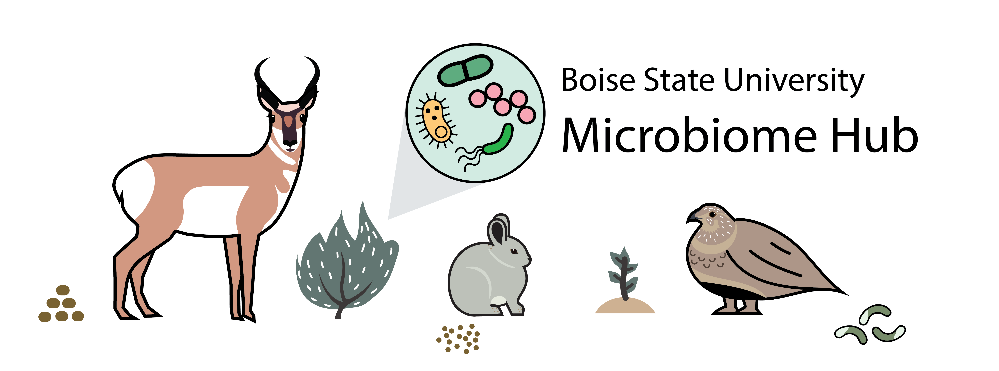

```{js logo-js, echo=FALSE}
$(document).ready(function() {
});
```

```{r packages, echo=FALSE, warning=FALSE, include=FALSE}
library(knitr)
library(rmarkdown)
library(bookdown)
#library(distill)
library(knitcitations)
library(formatR)
library(devtools)
library(kfigr)
library(dplyr)
library(kableExtra)
library(tufte)
#Generate BibTex citation file for all R packages used to produce report
knitr::write_bib(.packages(), file = 'packages.bib')
```

```{r repo, echo=FALSE, fig.align = 'center', out.width = '100%'}

```

# Vision Statement

The purpose of the Microbiome Hub at Boise State University is to develop resources to make microbiome pipelines, including community profiling via 16-S ([QIIME2](https://qiime2.org/)) and metagenomic shotgun sequencing ([Shogun](https://github.com/qiime2/q2-shogun)) readily accessible to researchers here and at our collaborating institutions. To achieve this, we will develop resources for researchers to upskill in using the high-performance computing environment (e.g., BORAH at Boise State University), complete microbiome pipelines, and analyze outputs. While these are being developed to primarily analyze datasets sequenced at UC San Diego (see list below), we anticipate that this pipeline can be readily transferred to ongoing projects at Boise State University (e.g., Bittleston Lab) and University of Wyoming (e.g., Beck Lab). 

# Ethos

Our group operates under the principles of [Kindness in Science](http://www.kindnessinscience.org/), where we foster a community of respect, inclusivity, wellbeing, and open communication. As such, resources from this hub are open-source and available for anyone to use, modify, and improve. 

# Quick Links

- [GoogleDrive](https://drive.google.com/drive/folders/1qXnymSF6D959-QATnl5D7QP6TUv0vFC4?usp=sharing) folder where resources are stored

- [GoogleDoc](https://docs.google.com/document/d/1Iog9DA8IQYRgNYYEhhcdXDV13U89HcB_TDfFOZAqW0k/edit?usp=sharing) detailing current QIIME2 Workflow

- [GoogleSheet](https://docs.google.com/spreadsheets/d/1kTnwmbrGl1I3SvsO9_LJbinHY3_5Ra2AcZs3caARJQ0/edit#gid=0) GAANT chart detailing the timeline

# Timeline & Ongoing Projects

Goals for this project, a list of ongoing projects, and timelines are captured in this GAANT chart, developed by Jessie Sherburne. This chart is meant to be a living document, showing the current status of all projects.

# Data Storage

All datasets from UC San Diego are currently being stored on [QIITA](https://qiita.ucsd.edu/), with backups of the raw data available on the BioCompute CIFS share at Boise State University. We anticipate that QIIME2 visualizations (*.qza) files and sbatch scripts will be made available in the Microbiome Hub folder on GoogleDrive prior to publication. All data will become publicly available via NCBI when published. Scripts for analyses will be available on GitHub. 